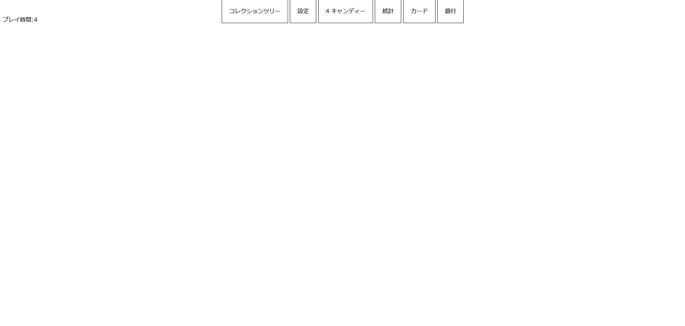

# Eatcandy
Eatcandy - 進化は終わらない

**このリポジトリは構想段階で、後述する機能が追加されていない所もあります。**

EatcandyはNoimzipが個人で製作しているゲームです。1秒ごとに1個キャンディが貰えて、それを貯めるだけのゲームです。

↓2023/12/30時点の初期テスト

## 使用プログラミング言語・ライブラリ

プログラミング言語
・Javascript

スタイルシート
・CSS 

マークアップ言語
・HTML

Javascript ライブラリ

・Chart.js(過去)

・Google tag (Google アナリティクス用)

## ゲームの概要

1秒に1個キャンディを貰い、貯めるだけの簡単なゲームです。コレクションシステムやカードシステムで生産量を増やすことも出来ます。

現在、主な課金要素はありません。今後キャンディの生産に関係しない形で課金要素を追加する可能性はありますが、今のところ追加できそうに無いです。

## ランクシステム

現在、プレイ時間に関するランクが既に実装されていますが、現在計画中のプレイヤー自身の可変ランクはまだ実装出来ていません。

## シーズンシステム

現在、シーズンシステムは2カ月程度の周期を計画しています。シーズンが変更されるたび、ランクとシーズンパスも更新していきます。

## 未実装・今後実装予定機能

・プレイヤーによる可変ランク

・銀行システム

・アイテムショップ

・カードシステム

・Googleアカウント連携機能

・実績